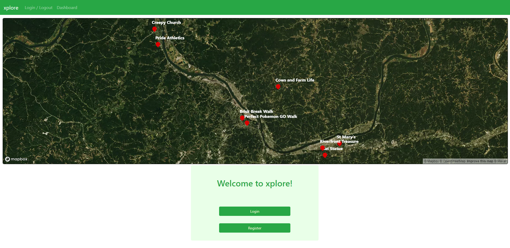
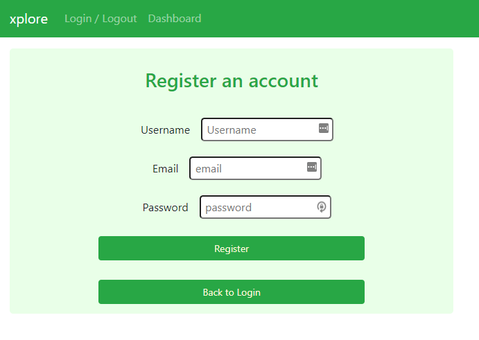
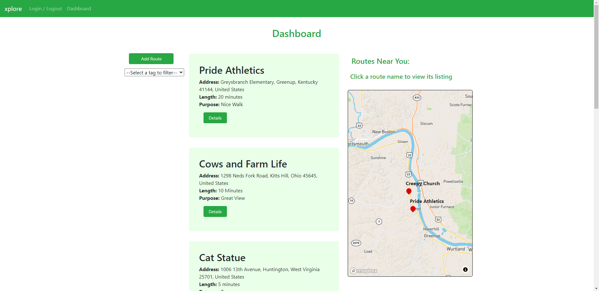
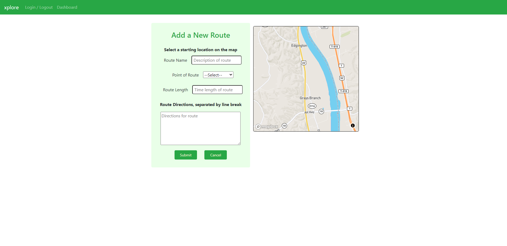
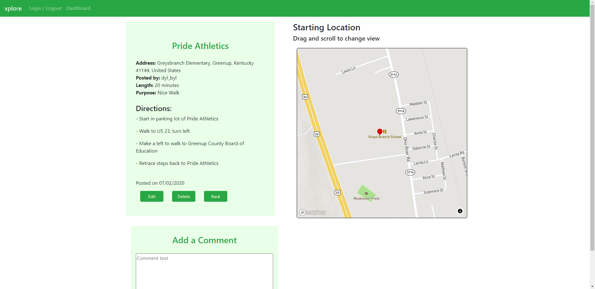
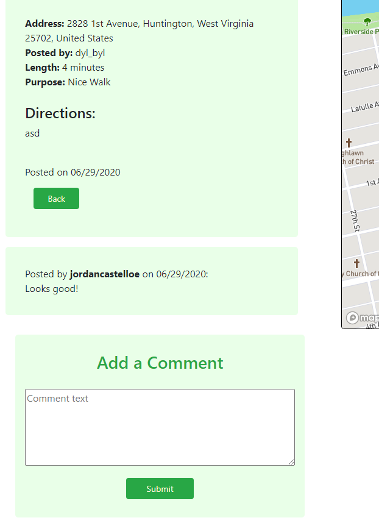
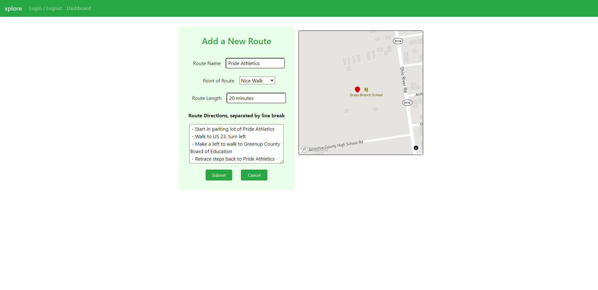

## About Xplore

Xplore is a real-life geolocating experience with a web-app interface. Users can pick a starting point and map a route through town using sentences, directions, and riddles--no GPS location services. Other users can report to the indicated starting point and follow the route on their own, in an attempt to 1) go on a short, real adventure, and 2) do so by relying on personal navigation skills and perception. It acts as a practice in both mindfulness and hiking.

Routes can be tagged based on their point or reward: the route itself, a small treasure at the end, a fantastic view along the way, riddle-based navigation, etc.

Xplore is for people who would like to experience nature and real-life in a mindful way. It’s designed to share fun-filled walks through real environments. Think of it as static MapQuest directions for walks, instead of dynamic turn-by-turn navigation. 

## Installing and Running the App

Visit [the Xplore GitHub page](https://github.com/dylbyl/xplore) and clone the branch to your local machine. In a GitBash terminal, navigate to the root folder of the project and run the command "npm install" to install node modules for React Bootstrap, React Mapbox GL JS, and React Router DOM. Then run "npm start" to open the app in a browser window. Also run "npm i json-server" to install JSON Server. We must first start our JSON server before we can fully explore the app.

Open a second GitBash terminal and navigate to the API folder within the root project folder. Run the command "json-server -p 8088 -w xplore.json" to start the JSON server. The app should now be fully functional within the browser window.

## Register and Login

On opening the app, you're greeted by the Home screen. Most notable this contains a large map of the Huntington/Ashland/Ironton Tri-State area, showing all routes posted in the region. At the bottom of the page, you'll find buttons to login or register an account.

Registration takes a unique email and username, as well as a password. You must input all three to proceed. Upon registration, you'll be automatically logged in and returned to the Home screen.

## Browsing Routes

The Dashboard can be accessed via a link in the nav-bar. When loaded, it shows all routes currently in the database, sorted by newest to oldest. The map on the right-hand side will automatically center on your location, as long as you allow location-services when the page loads. This map will populate with routes close to your location. Clicking a name in this map will automatically take you to that route's details page. 

You can also access this page by clicking "Details" on any card you desire. Each card shows a quick glimpse of the route, showcasing its name, starting address, length, and tagged purpose.

On the left, there's a button and a dropdown menu. The button will take you to a page to post a new route, while the dropdown menu allows you to sort through all posted routes using a specified tag/purpose.

## Adding a Route

Clicking the Add Route button on the dashboard brings you to a new page. Here, you can create a route by entering a name for the route, its purpose, its length, directions for the route, and the location it starts at. The map on the right centers on your current location, but can be dragged and scrolled to travel to a new location. Clicking the map drops a marker, signifying the starting location of your route.

## Route Detail

The Details page gives more info on any given route. It shows the starting address (also displayed on the right-hand map), user who posted, length, tagged purpose, directions, and all comments. If you posted the route you're currently looking at, this page will also have edit and delete buttons, to allow you to change the route at will.

Comments can easily be added and viewed through the Details page. Simply type a comment and click Submit!

## Editing a Route

In the Details view of any route you've posted, you're given the option to edit that route. Doing so leads you to a new page similar to the Add page. Here you can edit the route's name, length, purpose, directions, or starting location.

## Author

Xplore was created by Dylan Bishop. You can see more of his work [on his GitHub page](https://github.com/dylbyl)
